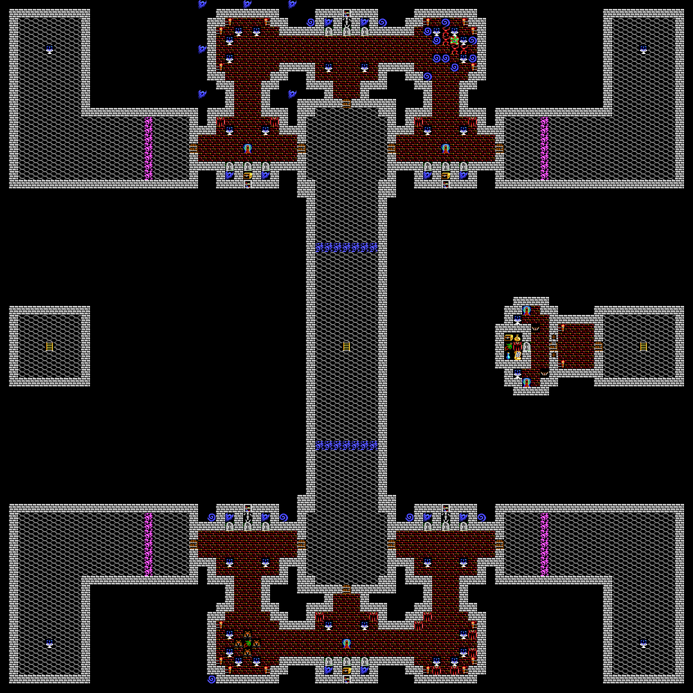
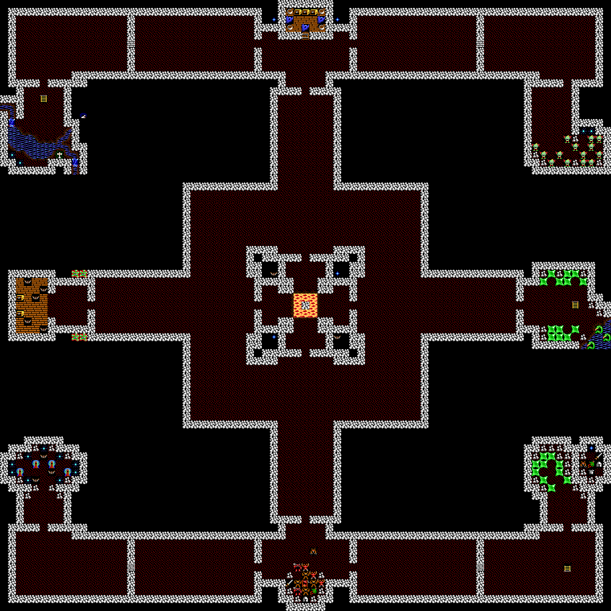

# Ultima V combat screen level dungeon mapper

Reads game data from Ultima V game and builds topdown dungeon maps with the
special encounter rooms and corridor maps as seen during combat.

Have [Rust language tools](https://www.rust-lang.org/tools/install) installed
to use.

Set path to Ultima V game directory with data files in environment variable
`ULTIMA_V_PATH`, eg

    ULTIMA_V_PATH=~/Games/Ultima5 cargo run --release

See the [img/ subdirectory](img/) for all generated maps.

Whirlpool tiles in combat rooms indicate a random monster at that spot.

## Example results

Covetous level 4

Shame level 8

## TODO

- Custom doorway alignment for tricky rooms in Destard.
